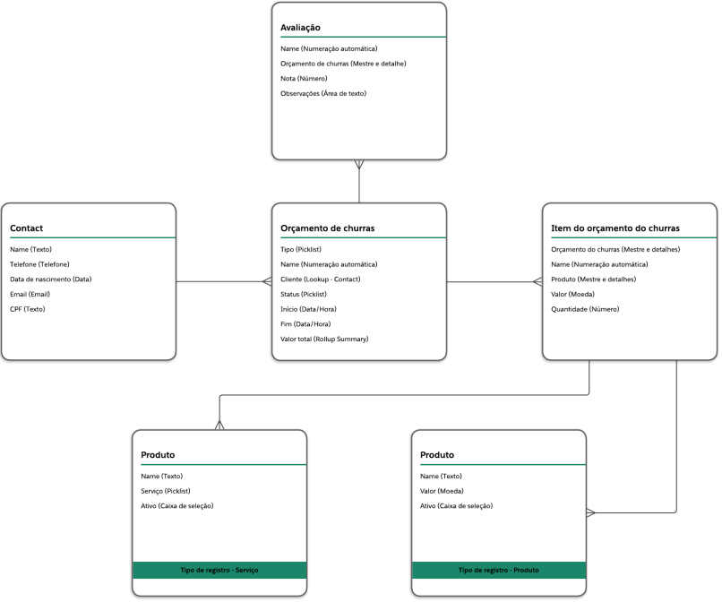
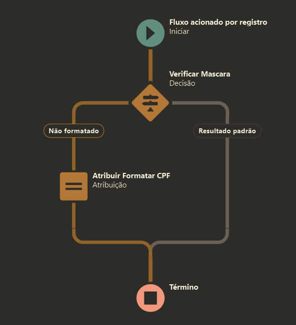
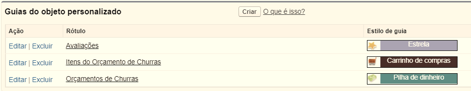
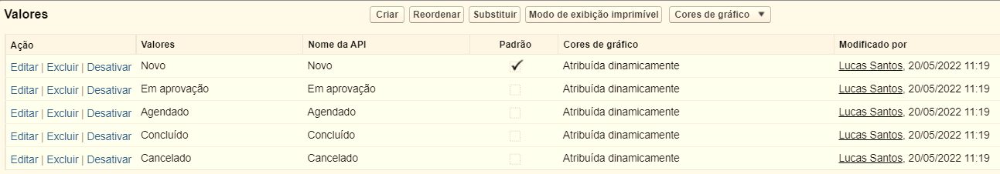
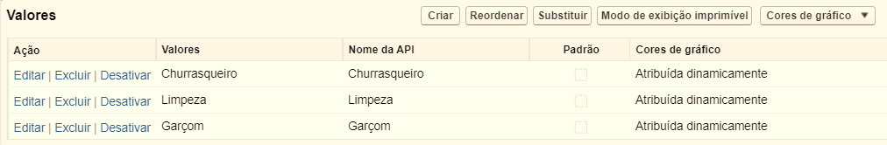

# Projeto Best Minds - Case Churras

---
## Objetivo do Desafio
*Avaliar o desempenho técnico e o conhecimento da plataforma Salesforce.*

## Solução
*O objetivo da solução é criar um aplicativo no Salesforce para registrar orçamentos de churrasco.*

## Modelo de Dados

---

## Solução Técnica / Explicações dos campos nos objetos

- ✅ 1 - **Contact** 
    - ☑️ **Name:** Campo padrão do Salesforce
    - ☑️ **CPF:** Campo texto que representa o CPF do Cliente
        - ☑️ Feito uma [regra de validação no Campo para validar o CPF](./adm/CPF__c/validationRule/CPF__c.apex)
       - ☑️ Feito um [Flow para verifcação da mascára e formatação do CPF](./adm/CPF__c/flow/CPF__c.apex)

Expandir detalhes do Flow

 
    - ☑️ **Telefone:** Campo padrão do Salesforce
    - ☑️ **Data de Nascimento:** Campo padrão do Salesforce
    - ☑️ **E-mail:** Campo padrão do Salesforce

- ✅ 2 - **Orçamento de churras** 
    - ☑️ **Name:** Campo de texto padrão do Salesforce que representa o nome do evento de churras
    - ❌ ~~Tipo: Lista de opções que representa o tipo do evento~~ - **Confirmado com o Bruno - Campo retirado**
    - ☑️ **Cliente:** Campo de relacionamento com o *[contato](#Contact)*
    - ☑️ **Status:** Campo de seleção de lista que representa o status do churras - *Deixei somente como leitura* - Opções: **Novo**,**Em Aprovação**, **Agendado**, **Concluído** e **Cancelado**
    - ☑️ **Início:** Campo de data hora que representa a data do Orçamento de churras
    - ☑️ **Fim:** Campo de data hora que representa a data do Orçamento de churras
    - ☑️ **Valor Total:** Campo de resumo de totalização dos valores dos itens

- ✅ 3 - **Item do orçamento de churras**
    - ☑️ **Name:** Numeração automática gerado pelo próprio Salesforce
    - ☑️ **Orçamento de churras:** Campo de relacionamento com o objeto *[Orçamento de churras](#OrcamentoChurras)* - **Mestre-Detalhe**
    - ☑️ **Produto:** Campo de relacionamento com o objeto *[Product2](#Product2)* - **Lookup**
    - ☑️ **Quantidade:** Campo numérico que representa a quantidade de itens
    - ☑️ **Valor:** Campo moeda que representa o valor do item

- ✅ 4 - **Product2**
    - ☑️ **Name:** Campo padrão do Salesforce
    - ☑️ **Tipo de registro:** Campo padrão do Salesforce que representa se é um produto ou serviço - Dois Tipos de Registros: **Serviço** e **Produto**
        - 🔲 Configurar campos para cada Tipo
    - ☑️ **Serviço:** Campo de lista de opções que representa o tipo do serviço - Opções: **"Churrasqueiro"**, **"Limpeza"** e **"Garçom"**
    - ☑️ **Valor:** Campo moeda que representa o custo do produto
    - ☑️ **Ativo:** Campo padrão do Salesforce

- ✅ 5 - **Avaliação**
    - ☑️ **Name:** Numeração automática gerado pelo próprio Salesforce
    - ☑️ **Orçamento de churras:** Campo de relacionamento com o objeto *[Orçamento de churras](#OrcamentoChurras)* - **Mestre-Detalhe**
    - ☑️ **Nota:** Campo numérico que representa a nota de 0 a 10 pela organização do evento
    - ☑️ **Observações:** Campo área de texto que representa as observações da nota dada

## Remover todos os campos e deixar somente o que foi pedido
---

## Regras de Negócio

- ✅ **1.** Todos os objetos criados deverão ter “Guias” para navegação.
    

Print:

    

    

    

- 🔲 **2.** Após os objetos e as guias criadas, um aplicativo com essas guias deverá ser criado.

- 🔲 **3.** Um cliente pode ser criado sem um CPF, mas sem esse campo preenchido, ele não pode
solicitar um orçamento de um churras

- 🔲 **4.** Se um produto/serviço não estiver ativado, ele não poderá ser selecionado como um item do
churras.

- 🔲 **5.** Não é permitido ter o mesmo contato cadastrado duas vezes com o mesmo CPF.

- ✅ **6.** Os valores de status do churras são:
    - **a.** *Novo (Valor padrão)*
    - **b.** *Em aprovação (Alterado quando submetido para aprovação)*
    - **c.** *Agendado (Alterado quando aprovado)*
    - **d.** *Concluído*
    - **e.** *Cancelado*

Print:

 

- 🔲 **7.** Um churras só poderá receber novos itens enquanto ele estiver como "Novo".

- 🔲 **8.** Quando um churras for "Agendado", uma notificação deverá ser feita ao cliente.

- 🔲 **9.** Criar um processo de aprovação simples para aprovação de um novo churras:
    - **a.** *Quando submetido, o campo Status deve ser alterado automaticamente para "Em aprovação"*
    - **b.** *Em caso de aprovação, alterar o campo Status para "Agendado" e enviar um e-mail informando a aprovação para o cliente.*
    - **c.** *Em caso de reprovação, alterar o campo Status para "Cancelado" e enviar um e-mail informando a reprovação para o cliente.*

- ✅ **10.** Os valores do campo Serviço do produto são:
    - *a. Churrasqueiro*
    - *b. Limpeza*
    - *c. Garçom*

Print:

 

- 🔲 **11.** Os layouts dos registros também serão avaliados, portanto, remova os campos não
utilizados.

- 🔲 **12.** Os Lightning Pages também serão avaliados, é importante que distribua os componentes da
tela de forma organizada.

- 🔲 **13.** Construir relatórios e painéis para análise dos KPI’s (Key Performance Indicator)

---

## Desafio de Desenvolvimento

- 🔲 **1. Componente de avaliação do churras**

    - 🔲 **a.** *Criar um componente em LWC que permita o usuário avaliar o churras quando ele for concluído*

    - 🔲 **b.** *O componente deverá ser exibido apenas quando o status estiver "Concluído" na tela do churras*

    - 🔲 **c.** *O componente deve permitir que o usuário coloque a nota e as observações do churras*

    - 🔲 **d.** *Ao fim da avaliação, um registro deverá ser salvo no Salesforce no objeto (Avaliação)*

---

- 🔲 **2. Batch de cancelamento de orçamento de churras não realizados**

    - 🔲 **a.** *Um trabalho diário, escrito em Apex (Scheduler/Batch) que cancelará os orçamentos de churras que não aconteceram após a data prevista.*

---
    
- 🔲 **3. Tela de submissão para aprovação do orçamento de churras**

    - 🔲 **a.** *Deve ser desenvolvido um Screen Flow.*

    - 🔲 **b.** *Caso o orçamento de churras tenha ao menos 1 item de serviço, deverá ser submetido à aprovação pelo flow*

    - 🔲 **c.** *Caso o orçamento de churras não tenha nenhum item de serviço, o Status deverá ser atualizado automaticamente para "Agendado"*

---

- 🔲 **4. Preenchimento automático do campo Valor no item do churras - Esclarecer sobre esse requisito com o Bruno/Fabrício** 

**Setup para cumprir requisito:**

- 🔲  Criar um Custom Metadata Type chamado “Tabela de preço de serviços”

**Esse objeto terá dois campos:**

- 🔲 **1.** *Serviço (Campo picklist que representa o tipo de serviço)*
    - **a.** *Churrasqueiro*
    - **b.** *Limpeza*
    - **c.** *Garçom*

- 🔲 **2.** *Valor hora do serviço (Campo moeda que representa o valor hora do tipo de serviço que será prestado).*

*Cadastrar três registros desse objeto:*
    - **Serviço de Churrasqueiro** | **Tipo:** *Churrasqueiro* | **Valor Hora do Serviço**: *20*
    - **Serviço de Limpeza** | **Tipo:** *Limpeza* | **Valor Hora do Serviço**: *30*
    - **Serviço de Garçom** | **Tipo:** *Garçom* | **Valor Hora do Serviço**: *25*

- 🔲 **1. Desenvolver um Apex Trigger que preencherá o valor no item do churras quando um for criado e o produto vinculado for do tipo serviço.**

    - 🔲 **a. O valor deverá ser preenchido conforme a quantidade, duração em horas do evento multiplicado pelo valor hora do tipo de serviço cadastrado nos metadados acima.**

    *(Ex.: Se contratado o serviço de 1 churrasqueiro, e o evento durar 5 horas, esse item deverá custar 100 reais.)*

    - 🔲 **b. Caso a duração do evento dure em tempo quebrado, a duração para o cálculo deverá ser arredondada para cima.**

    *(Ex.: Se o início for 12:00 e o fim 13:30, a duração será de 2 horas.)*

---

- 🔲 **5. Validação de itens duplicados no churras**

    **a.** *Toda vez que um item de churras for criado, o Apex Trigger deverá verificar se o churras já possui um item com o mesmo produto cadastrado.*

    **b.** *Uma mensagem de erro informando que o produto já existe naquele churras deverá ser exibida.*

---

## Testes

- 🔲 **Classes de teste:** *Cada classe deve estar coberta com ao menos 75% testes unitários e testando cada funcionalidade.*

## Usuário de Teste

**1. Sobrenome:** Education

**2. E-mail:** education@everymind.com.br

**3. Username:** [nome]. [sobrenome]@bestminds.com.bm2022-01

**4. Perfil:** Administrador do sistema

