# Projeto Best Minds - Case Churras

---
## Objetivo do Desafio
*Avaliar o desempenho técnico e o conhecimento da plataforma Salesforce.*

## Solução
*O objetivo da solução é criar um aplicativo no Salesforce para registrar orçamentos de churrasco.*

## Modelo de Dados

---

## Solução Técnica / Explicações dos campos nos objetos

- ✅ 1 - **Contact** 
    - ☑️ **Name:** Campo padrão do Salesforce
    - ☑️ **CPF:** Campo texto que representa o CPF do Cliente
    - ☑️ **Telefone:** Campo padrão do Salesforce
    - ☑️ **Data de Nascimento:** Campo padrão do Salesforce
    - ☑️ **E-mail:** Campo padrão do Salesforce

- ✅ 2 - **Orçamento de churras** 
    - ☑️ **Name:** Campo de texto padrão do Salesforce que representa o nome do evento de churras
    - ❌ ~~Tipo: Lista de opções que representa o tipo do evento~~ - **Confirmado com o Bruno - Campo retirado**
    - ☑️ **Cliente:** Campo de relacionamento com o *[contato](#Contact)*
    - ☑️ **Status:** Campo de seleção de lista que representa o status do churras - *Deixei somente como leitura* - Opções: **Novo**,**Em Aprovação**, **Agendado**, **Concluído** e **Cancelado**
    - ☑️ **Início:** Campo de data hora que representa a data do Orçamento de churras
    - ☑️ **Fim:** Campo de data hora que representa a data do Orçamento de churras
    - ☑️ **Valor Total:** Campo de resumo de totalização dos valores dos itens

- ✅ 3 - **Item do orçamento de churras**
    - ☑️ **Name:** Numeração automática gerado pelo próprio Salesforce
    - ☑️ **Orçamento de churras:** Campo de relacionamento com o objeto *[Orçamento de churras](#OrcamentoChurras)* - **Mestre-Detalhe**
    - ☑️ **Produto:** Campo de relacionamento com o objeto *[Product2](#Product2)* - **Lookup**
    - ☑️ **Quantidade:** Campo numérico que representa a quantidade de itens
    - ☑️ **Valor:** Campo moeda que representa o valor do item

- ✅ 4 - **Product2**
    - ☑️ **Name:** Campo padrão do Salesforce
    - ☑️ **Tipo de registro:** Campo padrão do Salesforce que representa se é um produto ou serviço - Dois Tipos de Registros: **Serviço** e **Produto**
        - ✅ Configurar campos para cada Tipo
    - ☑️ **Serviço:** Campo de lista de opções que representa o tipo do serviço - Opções: **"Churrasqueiro"**, **"Limpeza"** e **"Garçom"**
    - ☑️ **Valor:** Campo moeda que representa o custo do produto
    - ☑️ **Ativo:** Campo padrão do Salesforce

- ✅ 5 - **Avaliação**
    - ☑️ **Name:** Numeração automática gerado pelo próprio Salesforce
    - ☑️ **Orçamento de churras:** Campo de relacionamento com o objeto *[Orçamento de churras](#OrcamentoChurras)* - **Mestre-Detalhe**
    - ☑️ **Nota:** Campo numérico que representa a nota de 0 a 10 pela organização do evento
    - ☑️ **Observações:** Campo área de texto que representa as observações da nota dada

📷 Print do Schema Builder e ligações dos Objetos Criados e Requisitados:

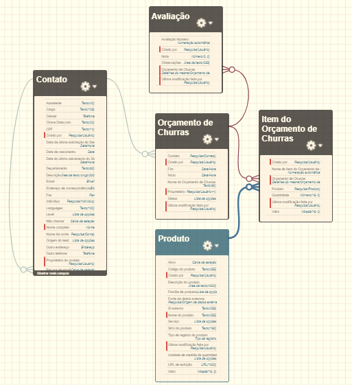

---

## Regras de Negócio

- ✅ **1.** Todos os objetos criados deverão ter “Guias” para navegação.
    

📷 Print:

    

    

- ✅ **2.** Após os objetos e as guias criadas, um aplicativo com essas guias deverá ser criado.
    

📷 Print:

    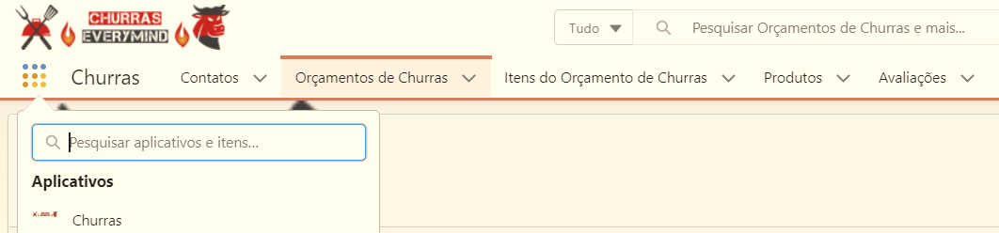
    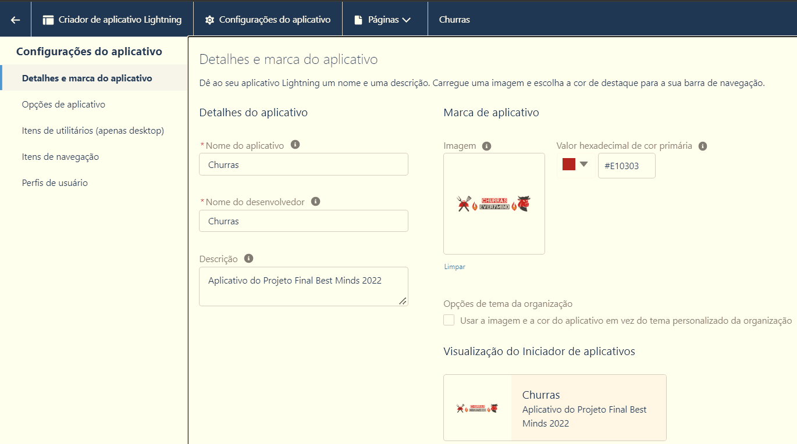

    

- ✅ **3.** Um cliente pode ser criado sem um CPF, mas sem esse campo preenchido, ele não pode solicitar um orçamento de um churras
    
    

📷 Print da regra:

    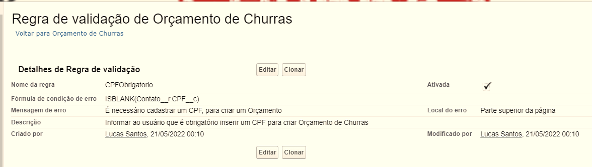

    

    

📷 Evidência - Testando a regra:

    

    

    

- ✅ **4.** Se um produto/serviço não estiver ativado, ele não poderá ser selecionado como um item do churras.
    

📷 Print das regras:

    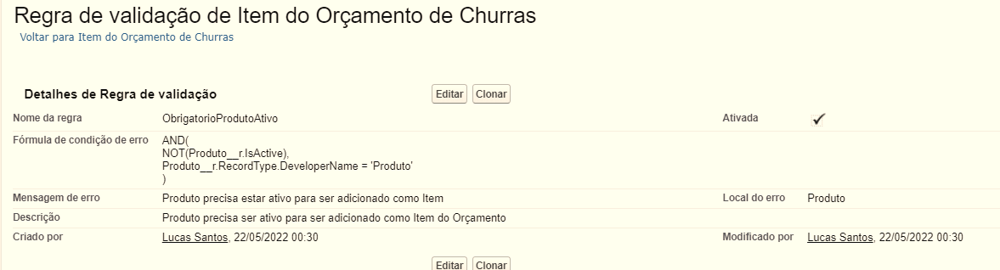
    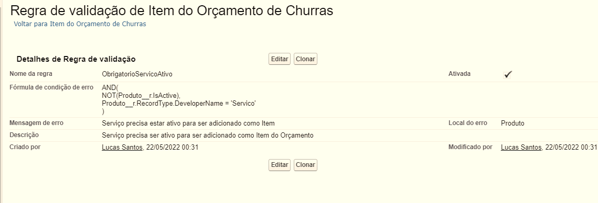

    

    

📷 Evidência - Testando a regra:

    
    

    

- ✅ **5.** Não é permitido ter o mesmo contato cadastrado duas vezes com o mesmo CPF. - **Regra de Duplicidade**
    

📷 Print da regra:

    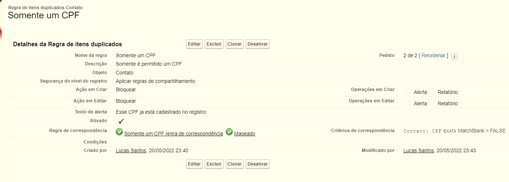
    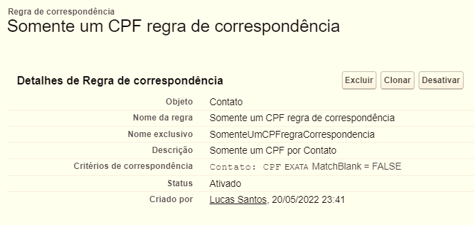

    

    

📷 Testando regra Criando:

    

    

    

📷 Testando regra Editando:

    

    

- ✅ **6.** Os valores de status do churras são:
    - **a.** *Novo (Valor padrão)*
    - **b.** *Em aprovação (Alterado quando submetido para aprovação)*
    - **c.** *Agendado (Alterado quando aprovado)*
    - **d.** *Concluído*
    - **e.** *Cancelado*

    

📷 Print:

    

    

- ✅ **7.** Um churras só poderá receber novos itens enquanto ele estiver como "Novo".
    

📷 Print da regra:

    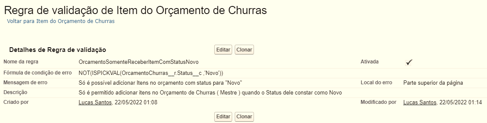

    

    ⚠️ Fazer evidência depois ⚠️

- ✅ **8.** Quando um churras for "Agendado", uma notificação deverá ser feita ao cliente.

>    Achei bug que quando o campo é atualizado pelo Approval Process, o Bell Notification não funciona, workaround seria criar um campo checkbox ( Foi Aprovado__c ) e acionar pelo campo junto com o valor do Status Agendado - [Developer Salesforce](https://developer.salesforce.com/forums/?id=9062I000000DOQMQA4), para conseguir resolver esse problema, utilizei o flow e consultei esse vídeo [Youtube](https://www.youtube.com/watch?v=zful5lBobOk)
    ⚠️ Fazer evidência depois ⚠️

- ✅ **9.** Criar um processo de aprovação simples para aprovação de um novo churras:
    

📷 Prints do Processo de Aprovação e Template de E-mail:

    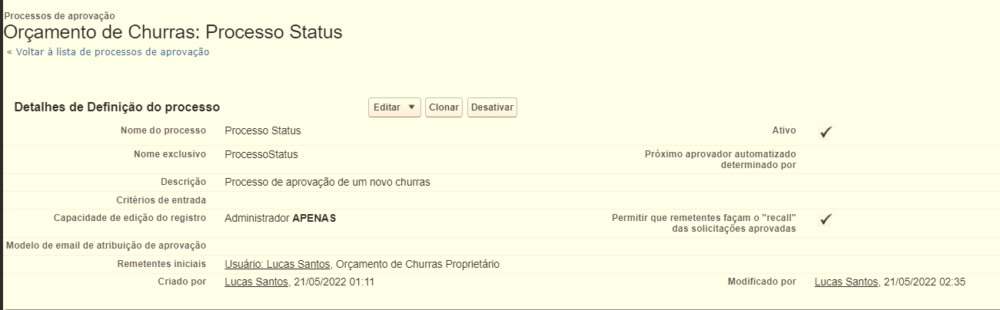
    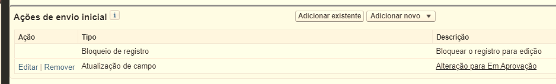
    
    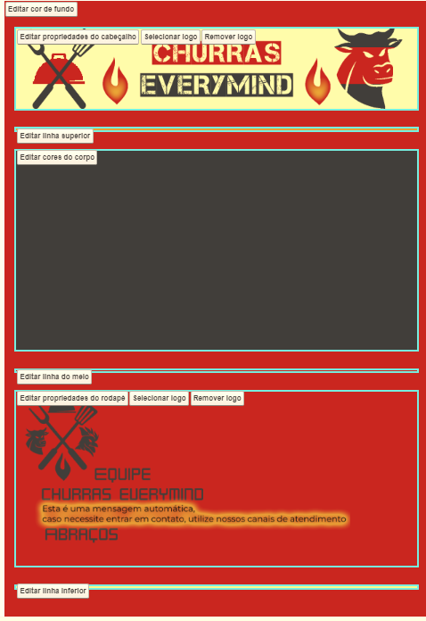
    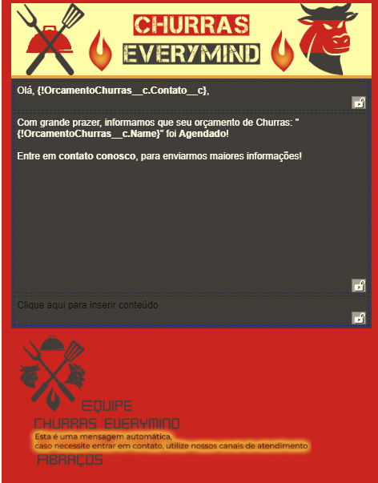
    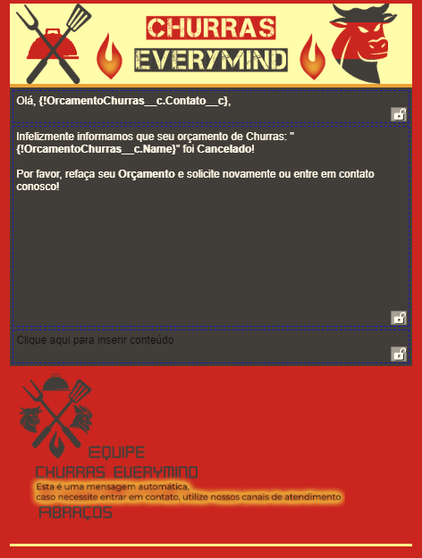

    

    ### ⚠️Atualizar print pelo Campo aprovade para False agora ⚠️

    - **a.** *Quando submetido, o campo Status deve ser alterado automaticamente para "Em aprovação"*
        

📷 Evidência:

        

        

    - **b.** *Em caso de aprovação, alterar o campo Status para "Agendado" e enviar um e-mail informando a aprovação para o cliente.*
        

📷 Evidência:

        

        

    - **c.** *Em caso de reprovação, alterar o campo Status para "Cancelado" e enviar um e-mail informando a reprovação para o cliente.*
        

📷 Evidência:

        

        

- ✅ **10.** Os valores do campo Serviço do produto são:
    - *a. Churrasqueiro*
    - *b. Limpeza*
    - *c. Garçom*

    

Print:

    

    

- ✅ **11.** Os layouts dos registros também serão avaliados, portanto, remova os campos não
utilizados.

⚠️ *Falta tirar prints dos layouts de registros* ⚠️

- ✅ **12.** Os Lightning Pages também serão avaliados, é importante que distribua os componentes da
tela de forma organizada.

⚠️ *Falta tirar prints dos layouts de registros* ⚠️

- 🔲 **13.** Construir relatórios e painéis para análise dos KPI’s (Key Performance Indicator)
    - Maiores Orçamentos
    - Itens por Orçamento
    - Clientes novos por Mês
    - Clientes com possiblidade de fazer um orçamento
    - Orçamentos Agendados x Orçamentos Cancelados
    - Orçamentos Concluídos
    - Avaliações por Orçamento

---

## Desafio de Desenvolvimento

- 🔲 **1. Componente de avaliação do churras**

    - 🔲 **a.** *Criar um componente em LWC que permita o usuário avaliar o churras quando ele for concluído*

    - 🔲 **b.** *O componente deverá ser exibido apenas quando o status estiver "Concluído" na tela do churras*

    - 🔲 **c.** *O componente deve permitir que o usuário coloque a nota e as observações do churras*

    - 🔲 **d.** *Ao fim da avaliação, um registro deverá ser salvo no Salesforce no objeto (Avaliação)*

    - 🔲 **CSS: Editar os    botões com classe de CSS e aplicar tanto fora quanto dentro de um form**

---

- ✅ **2. Batch de cancelamento de orçamento de churras não realizados**

    - ✅ **a.** *Um trabalho diário, escrito em Apex (Scheduler/Batch) que cancelará os orçamentos de churras que não aconteceram após a data prevista.*

---
    
- ✅ **3. Tela de submissão para aprovação do orçamento de churras**

    - ✅ **a.** *Deve ser desenvolvido um Screen Flow.*

    - ✅ **b.** *Caso o orçamento de churras tenha ao menos 1 item de serviço, deverá ser submetido à aprovação pelo flow*

    - ✅ **c.** *Caso o orçamento de churras não tenha nenhum item de serviço, o Status deverá ser atualizado automaticamente para "Agendado"*

    ### Tirar Evidência depois ###

---

- 🔲 **4. Preenchimento automático do campo Valor no item do churras - Esclarecer sobre esse requisito com o Bruno/Fabrício** 

**Setup para cumprir requisito:**

- 🔲  Criar um Custom Metadata Type chamado “Tabela de preço de serviços”

**Esse objeto terá dois campos:**

- 🔲 **1.** *Serviço (Campo picklist que representa o tipo de serviço)*
    - **a.** *Churrasqueiro*
    - **b.** *Limpeza*
    - **c.** *Garçom*

- 🔲 **2.** *Valor hora do serviço (Campo moeda que representa o valor hora do tipo de serviço que será prestado).*

*Cadastrar três registros desse objeto:*
    - **Serviço de Churrasqueiro** | **Tipo:** *Churrasqueiro* | **Valor Hora do Serviço**: *20*
    - **Serviço de Limpeza** | **Tipo:** *Limpeza* | **Valor Hora do Serviço**: *30*
    - **Serviço de Garçom** | **Tipo:** *Garçom* | **Valor Hora do Serviço**: *25*

- 🔲 **1. Desenvolver um Apex Trigger que preencherá o valor no item do churras quando um for criado e o produto vinculado for do tipo serviço.**

    - 🔲 **a.** *Quando o produto vinculado for do tipo **PRODUTO**, o valor deverá ser preenchido com a multiplicação da quantidade x custo do produto*

    - 🔲 **b.** *Quando o produto for do tipo **SERVIÇO**, o valor deverá ser preenchido conforme a quantidade, duração em horas do evento multiplicado pelo valor hora do tipo de serviço cadastrado nos metadados acima.*

    *(Ex.: Se contratado o serviço de 1 churrasqueiro, e o evento durar 5 horas, esse item deverá custar 100 reais.)*

    - 🔲 **c.** *Caso a duração do evento dure em tempo quebrado, a duração para o cálculo deverá ser arredondada para cima.*

    *(Ex.: Se o início for 12:00 e o fim 13:30, a duração será de 2 horas.)*

---

- 🔲 **5. Validação de itens duplicados no churras**

    **a.** *Toda vez que um item de churras for criado, o Apex Trigger deverá verificar se o churras já possui um item com o mesmo produto cadastrado.*

    **b.** *Uma mensagem de erro informando que o produto já existe naquele churras deverá ser exibida.*

---

## Testes

- 🔲 **Classes de teste:** *Cada classe deve estar coberta com ao menos 75% testes unitários e testando cada funcionalidade.*

#### Classes em Ordem para Verificar

- ✅ *Schedule e Batch*

## ✅ Usuário de Teste

**1. Sobrenome:** Education

**2. E-mail:** education@everymind.com.br

**3. Username:** [nome]. [sobrenome]@bestminds.com.bm2022-01

**4. Perfil:** Administrador do sistema

**Somente resetar a senha e tirar evidência**

---

## Incrementos e ideias adicionais

- ✅ Feito uma [regra de validação no Campo para validar o CPF](./adm/CPF__c/validationRule/CPF__c.apex)
- ✅ Feito um [Flow para verifcação da mascára e formatação do CPF](./adm/CPF__c/flow/CPF__c.apex)

 📷 Print do Flow

 📷 Evidência testando com número inválido, faltante e pontuação errada: 

 

- ✅ Usuário não consegue mudar o Status sem passar pelo processo de aprovação
    > Filtragem do botão pelo Lightning Page e remoção do Status Concluído
- ✅ Criei Flow para permitir depois de Agendado se quiser Cancelar ou Concluir Orçamento de Churras, porque eu não deixo para optar manualmente para não burlar processo de aprovação

- 🔲 Criar regra de validação para Inicio e Fim não ser menor que hoje
- 🔲 Criar regra de validação para mensagem de erro de Contato Nulo
- 🔲 Melhorar layout dos fluxos de tela ( Centralizar mensagens )
- 🔲 Formatação de telefone
- 🔲 Fazer desconto de 5% ou 10% se for mês de aniversârio do contato atrelado ao Orçamento
- 🔲 Criar tarefa para o usuário para lembrar de por o CPF para solicitar o orçamento*

